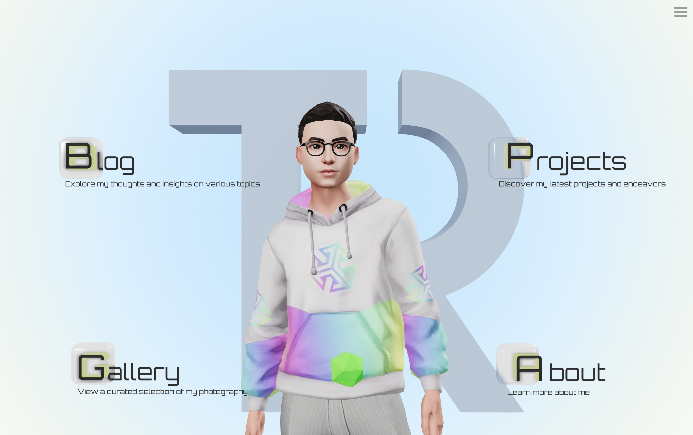

<p align="center">
  <image src="doc/logo.png" with="128" height="128">
</p>
<h3 align="center">Roger Twan</h3>
<p align="center">Personal website developed using Next and Tailwind. Seamlessly integrated with Obsidian. Visit <a href="https://roger.ink" target="_blank">here</a></p>
<p align="center">
  <image src="https://img.shields.io/badge/dynamic/json?label=Version&query=version&url=https%3A%2F%2Fraw.githubusercontent.com%2FRoger-twan%2Flab%2Fmain%2Fpackage.json&color=cyan">
  <image src="https://img.shields.io/badge/dynamic/json?label=NODE&query=engines.node&url=https%3A%2F%2Fraw.githubusercontent.com%2FRoger-twan%2Flab%2Fmain%2Fpackage.json&color=purple">
  <image src="https://img.shields.io/badge/dynamic/json?label=NPM&query=engines.npm&url=https%3A%2F%2Fraw.githubusercontent.com%2FRoger-twan%2Flab%2Fmain%2Fpackage.json&color=purple">
  <image src="https://img.shields.io/badge/dynamic/json?label=Next&query=dependencies.next&url=https%3A%2F%2Fraw.githubusercontent.com%2FRoger-twan%2Flab%2Fmain%2Fpackage.json">
  <image src="https://img.shields.io/badge/dynamic/json?label=Tailwind&query=devDependencies.tailwindcss&url=https%3A%2F%2Fraw.githubusercontent.com%2FRoger-twan%2Flab%2Fmain%2Fpackage.json">
</p>
<hr>

## 📸 Screenshot



## ⚒️ Development

Create a `.env` file on the root directory and add `GITHUB_TOKEN` to it.

```bash
# install dependencies
npm install

# run server
npm run dev
```

Open [http://localhost:3000](http://localhost:3000) in the browser to view the result.

## 🤖 GitHub Actions

Integrated with GitHub Actions, will automatically run code check whenever there is a push to the main branch.

## 📝 Change Logs

### 4.0.1 (2025-08-25)

- [Improvement] Adjust the height of the TOC to be the same as the blog content

### 4.0.0 (2025-08-05)

- [New Feature] Post comments support
- [New Feature] GitHub Webhook handler
- [Improvement] Redesign the interface, upgrade Next version to v15
- [Improvement] [SEO Integration](https://github.com/roger-twan/website/issues/34), add sitemap and robots.txt
- [Improvement] Dynamic portfolio & skills data fetching from Obsidian

### 3.4.2 (2025-06-10)

- [Improvement] Adjust configuration for cloud development environment.
- [Improvement] Update skills & portfolio

### 3.4.1 (2025-01-05)

- [Improvement] Add new skill & update project tags

### 3.4.0 (2024-12-28)

- [New Feature] Add skills screenshot feature using Playwright

### 3.3.0 (2024-12-28)

- [Improvement] Redesigned Home page
- [Improvement] Add skill journey to About page
- [Improvement] Improve SVG file

### 3.2.0 (2024-12-26)

- [Improvement] [Add loading to the homepage](https://github.com/roger-twan/website/issues/27)
- [Improvement] [Display menu on the homepage instead of the value](https://github.com/roger-twan/website/issues/21)
- [Bugfix] Fix len model display issue.

### 3.1.3 (2024-12-22)

- [Improvement] Add a Java project -- SSO.

### 3.1.2 (2024-11-29)

- [Improvement] Add a Node.js project -- Simple API.

### 3.1.1 (2024-09-28)

- [Improvement] [Optimize the photos quality in the Gallery page](https://github.com/roger-twan/website/issues/24)
- [Improvement] Upgrade Next version to v14.

### 3.1.0 (2024-09-22)

- [New Feature] Add Gallery page.

### 3.0.4 (2024-09-21)

- [Improvement] Add a Python project.

### 3.0.3 (2024-09-11)

- [Improvement] Remove the cursor pointer on the project title to avoid causing confusion.

### 3.0.2 (2024-09-04)

- [Improvement] Support for multiple project links.

### 3.0.1 (2024-09-03)

- [Bug fix] [Menu disappear animation](https://github.com/roger-twan/website/issues/20)

### 3.0.0 (2024-09-02)

- New UI presentation, along with innovative technology and a new architecture.
