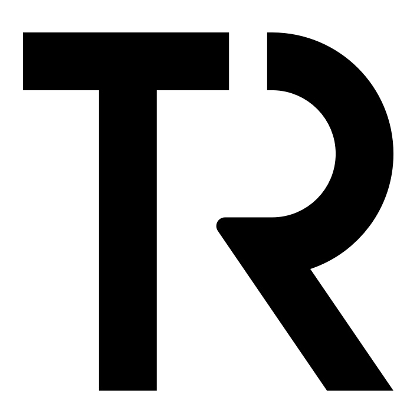

<p align="center">
  
</p>

<h3 align="center">Roger Twan</h3>

<p align="center">
  Personal website for an AI-assisted product engineer, built with Next.js and Tailwind CSS.
  Visit <a href="https://roger.ink" target="_blank">roger.ink</a>.
</p>

<p align="center">
  
  
  
  
  
</p>

---

## Overview

This repository powers my personal website and portfolio, focused on AI-assisted product engineering: how I use AI across research, prototyping, design, development, review, documentation, testing, and iteration.

The site presents my work as a full-stack product engineer moving closer to AI-native product engineering. It combines polished product surfaces, project evidence, journal writing, and a RAG-powered chat experience through Roger's AI.

## Site Structure

- `/` - Homepage focused on AI-assisted product workflow and selected work
- `/projects` - Project archive with category filtering
- `/journal` - Build notes, technical writing, and product reflections
- `/chat` - Roger's AI, a RAG-powered conversational interface
- `/about` - Background, working model, experience, and education
- `/contact` - Contact channels and collaboration intent

## Architecture

- Next.js App Router for routing and server-rendered pages
- Tailwind CSS for the responsive interface and visual system
- Structured project and journal data modules
- Obsidian-backed content sources for projects, journal entries, and portfolio context
- RAG-powered chat interface connected to an external AI backend
- Unit and e2e checks for key UI behavior

## Content Sources

Projects, journal entries, and portfolio context are maintained in my Obsidian workspace and transformed into structured site data. Roger's AI uses this content as part of its retrieval context, so the chat experience can answer questions about my work, projects, and writing.

## Development

Copy the `_env` template file to `.env`, then configure the correct values for the required environment variables.

```bash
npm install
npm run dev
```

Open <http://localhost:3000> in the browser.

## Scripts

- `npm run dev` - Start the local development server
- `npm run lint` - Run lint checks
- `npm run test:unit` - Run unit tests
- `npm run test:e2e` - Run Playwright tests
- `npx tsc --noEmit` - Run TypeScript checks

Common verification flow:

```bash
npm run lint
npx tsc --noEmit
npm run test:unit
npm run test:e2e
```

## GitHub Actions

GitHub Actions runs code checks whenever changes are pushed to the main branch.

## Build Logs

See [docs/BUILD_LOGS.md](docs/BUILD_LOGS.md) for the full history.

### 5.2.0 (2026-08-10)

- [Improvement] Replace the default 404 page with a responsive route-scanner experience
- [Improvement] Add radar and signal-glitch visuals with reduced-motion support
- [Improvement] Provide clear paths back to the homepage and projects archive

### 5.1.0 (2026-07-07)

- [Improvement] Highlight evaluated RAG-backed answers with LangSmith tracing and RAGAS-backed evaluation
- [Improvement] Limit homepage selected work preview to the first three projects

### 5.0.0 (2026-07-05)

- [Revamp] Reposition the site around AI-assisted product engineering
- [Improvement] Redesign homepage, projects, journal, about, contact, and chat experiences
- [Improvement] Rename portfolio and blog surfaces to projects and journal
- [Improvement] Refresh README structure and move full build logs into docs
